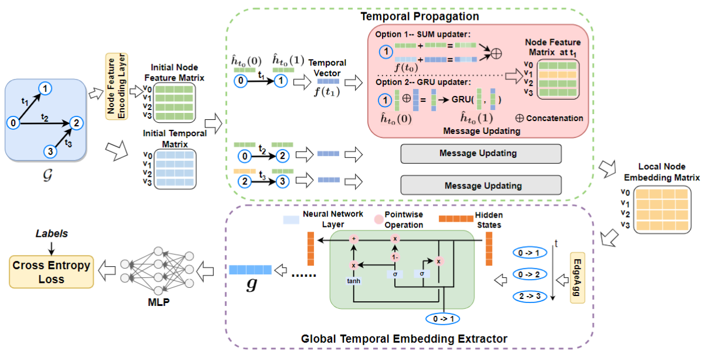

# TP-GNN: Continuous Dynamic Graph Neural Network for Graph Classification
<!--#### -->
## Introduction
Graph-level analysis is commonly needed in real-world dynamic networks. For instance, system logs provide comprehensive insights into the operational behaviors of a system. However, the existing DGNNs are only designed for node- or edge-level tasks. To the best of our knowledge, no existing solution is available for graph-level tasks in dynamic networks.

In this paper, we propose a continuous dynamic graph neural network --TP-GNN, intended for graph classification in dynamic networks, which compass two primary components: (1)Temporal propagation: this method follows the direction of information flow in capturing the long dependencies within the dynamic networks. In this way, the learned representations of the nodes encode distinct temporal features for different graph classes. (2)Global Temporal Embedding Extractor: The extractor inputs the edges into the GRU according to the temporal order in which they are established in the network to learn the evolution process of network topology over time for accurate dynamic network analytics.

The proposed approach handles the graph classification task on four different datasets and has good performance.

<!-- #### Paper link: [TP-GNN: Continuous Dynamic Graph Neural Network for Graph Classification](https://XXX) -->

## Running the experiments


### Dataset and preprocessing

#### Download the public dataset
* [HDFS](https://doi.org/10.5281/zenodo.1144100)
  
* [Gowalla](https://snap.stanford.edu/data/loc-gowalla.html)
  
* [Brightkite](http://snap.stanford.edu/data/loc-brightkite.html)

#### Download the Forum-java dataset
As for the Forum-java dataset we created in the paper, its contents are available in the [dataset](https://github.com/TP-GCN/TP-GCN/edit/main/Dataset/Forum-java) folder

#### Use your own data
See [example](https://github.com/TP-GCN/TP-GCN/edit/main/example) for the required input data format.

### Requirements

* python >= 3.9

* Dependency

```{bash}
torch==1.12.0
tqdm==4.64.0
numpy==1.18.5
scikit-learn==0.24.2
```

### Command and configurations

#### Sample commend
* Learning the anomaly detection task
```{bash}
# on Forum-java
python -u train_graph.py -d Forum-java --bs 32 --n_epoch 10 --lr 0.001 --node_dim 32 --time_dim 6 --edge_agg mean --divide 0.3 --updater sum

# on HDFS
python -u train_graph.py -d HDFS --bs 32 --n_epoch 10 --lr 0.001 --node_dim 32 --time_dim 6 --edge_agg mean --divide 0.3 --updater sum

# on Gowalla
python -u train_graph.py -d Gowalla --bs 32 --n_epoch 10  --lr 0.001  --node_dim 32 --time_dim 6 --edge_agg mean --divide 0.3 --updater sum

# on Brightkite
python -u train_graph.py -d Brightkite --bs 32 --n_epoch 10  --lr 0.001 --node_dim 32 --time_dim 6 --edge_agg mean --divide 0.3 --updater sum
```

#### General flags

```{txt}
optional arguments:
  -d DATA, --data DATA                       data sources to use
  --bs BS                                    batch_size
  --n_epoch N_EPOCH                          number of epochs
  --lr LR                                    learning rate
  --node_dim NODE_DIM                        dimensions of the GRU hidden size
  --time_dim TIME_DIM                        dimensions of the time embedding
  --edge_agg {mean,had,w1,w2,activate}       EdgeAgg method
  --divide                                   the ratio of training sets
  --updater                                  message passing way of temporal propagation
```

#### Cite
L. Jie et al., "TP-GNN: Continuous Dynamic Graph Neural Network for Graph Classification" 2024 IEEE 40th International Conference on Data Engineering (ICDE), Utrecht, Netherland, 2024, 
keywords: {Dynamic graph neural networks, Dynamic networks, Dynamic graphs, Graph classification},
